# 🏭 Integrated Smart Factory Cyber-Physical System

### Siemens TIA Portal + S7-PLCSIM + Factory I/O + ESP32 + AI + Digital Twin

> **An integrated cyber-physical industrial automation platform connecting a Siemens PLC-controlled virtual factory with a real ESP32-based motor, real-time sensor acquisition, AI-driven anomaly detection, predictive maintenance analytics, digital twin visualization, and coordinated safety control.**

<p align="center">

**Virtual Factory × Physical Asset × AI × Digital Twin**

</p>

---

# 🎥 Full System Demonstration

> **Complete integration of the virtual industrial process, PLC control, physical motor, AI monitoring, Digital Twin, and safety system.**

<p align="center">
  <a href="YOUR_VIDEO_LINK_HERE">
    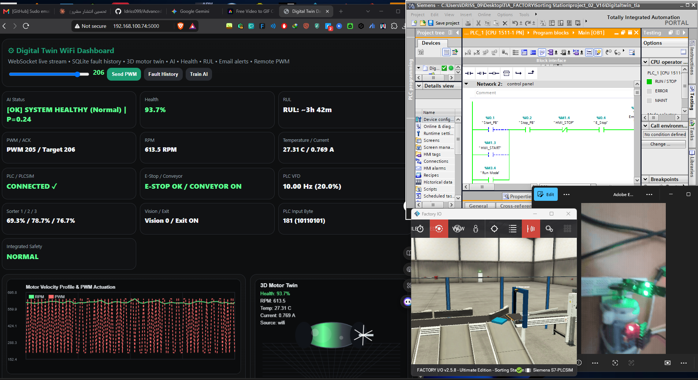
  </a>
</p>

<p align="center">
  ▶️ <b><a href="YOUR_VIDEO_LINK_HERE">Watch the Complete System Demonstration</a></b>
</p>

### Demonstration Highlights

* Siemens TIA Portal PLC control
* S7-PLCSIM virtual PLC
* Factory I/O production environment
* Python industrial middleware
* Real ESP32-controlled motor
* Real-time sensor acquisition
* AI-based anomaly detection
* Digital Twin monitoring
* Health Index calculation
* RUL estimation
* PLC ↔ physical system coordination
* Unified safety shutdown
* Fault logging and monitoring

---

# 🧠 Project Overview

This project presents an **Integrated Smart Factory Cyber-Physical System** designed to demonstrate the interaction between a virtual industrial production environment and a physical motor condition-monitoring platform.

The system combines:

**Siemens PLC automation + Factory I/O + Python middleware + ESP32 + physical sensors + AI + Digital Twin + predictive maintenance + safety coordination.**

Unlike a conventional Factory I/O automation project, the platform creates a software bridge between the virtual industrial process and a real physical asset.

The objective is to explore how **Cyber-Physical Systems (CPS)** and **Digital Twin technologies** can support intelligent industrial automation, condition monitoring, anomaly detection, and predictive maintenance.

---

# ⭐ Key Features

* 🏭 Siemens PLC-based industrial automation
* 🖥️ TIA Portal engineering environment
* 🔄 S7-PLCSIM virtual PLC
* 🏗️ Factory I/O virtual production system
* 🔌 Snap7 PLC communication
* ⚙️ Real ESP32-based motor platform
* 📡 WiFi / Serial telemetry
* 📊 Multi-sensor condition monitoring
* 🤖 Random Forest anomaly detection
* ❤️ Multi-sensor Health Index
* ⏳ Health-index-based RUL estimation
* 🪞 Real-time Digital Twin dashboard
* 🌐 Flask + WebSocket communication
* 🗄️ SQLite historical data storage
* 🚨 Automated fault detection and logging
* 📧 Email fault notifications
* 🛡️ Coordinated virtual/physical safety shutdown
* 🔄 Operator START / STOP / RESET logic
* 📈 Real-time industrial telemetry visualization

---

# 🏗️ System Architecture

<p align="center">
  
</p>

### Architecture Overview

The system is organized into interconnected virtual, physical, intelligence, communication, and data layers.

```text
                         ┌──────────────────────────┐
                         │       FACTORY I/O        │
                         │   Virtual Production     │
                         └────────────┬─────────────┘
                                      │
                                  S7-PLCSIM
                                      │
                                      ▼
                         ┌──────────────────────────┐
                         │       TIA PORTAL         │
                         │    Siemens PLC Control   │
                         └────────────┬─────────────┘
                                      │
                                    Snap7
                                      │
                                      ▼
                  ┌────────────────────────────────────┐
                  │      PYTHON INDUSTRIAL MIDDLEWARE  │
                  │                                    │
                  │ Flask │ WebSocket │ Safety │ AI   │
                  └──────────┬─────────────┬───────────┘
                             │             │
                ┌────────────┘             └─────────────┐
                ▼                                        ▼
       ┌──────────────────┐                    ┌──────────────────┐
       │      ESP32       │                    │    AI ENGINE     │
       │    Real Motor    │                    │  Random Forest   │
       │    + Sensors     │                    │ Fault Detection  │
       └────────┬─────────┘                    └──────────────────┘
                │
            WiFi / Serial
                │
                ▼
       ┌─────────────────────────────────────┐
       │          DIGITAL TWIN               │
       │       Real-Time Dashboard           │
       │  RPM / Temp / Current / Vibration   │
       │      Health / RUL / AI / PLC        │
       └─────────────────────────────────────┘
```

---

# 🏭 System Overview

<p align="center">
  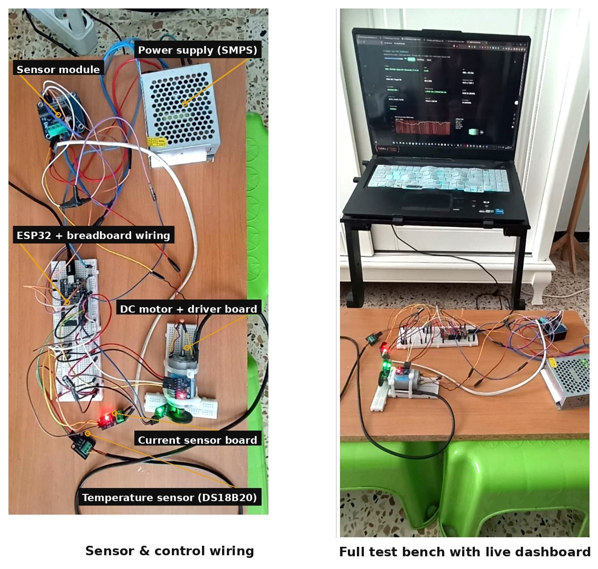
</p>

The experimental platform integrates a **virtual industrial production environment** with a **physical motor condition-monitoring platform**.

The Python middleware provides the central communication and coordination layer between the PLC environment, physical motor, AI engine, database, and Digital Twin dashboard.

---

# 🔄 Cyber-Physical Data Flow

```text
Virtual Industrial Process
          │
          ▼
      Siemens PLC
          │
          ▼
    Python Middleware
          │
     ┌────┴─────┐
     ▼          ▼
 Physical    AI Engine
 Motor          │
     │          ▼
     │      Fault Detection
     │          │
     └────┬─────┘
          ▼
     Digital Twin
          │
          ▼
   Monitoring / Decision
          │
          ▼
    Safety Response
```

This architecture enables the monitored physical asset and the virtual industrial process to be observed and coordinated through a common software layer.

---

# ⚙️ 1. Siemens Industrial Automation

The industrial process is implemented using the Siemens automation ecosystem.

### Technologies

* Siemens TIA Portal
* S7-PLCSIM
* Siemens PLC programming
* Digital Inputs / Outputs
* VFD command simulation
* Conveyor control
* Vision sensor signals
* Production counters
* Equipment status monitoring
* Emergency-stop logic
* Operator control logic

### PLC Functions

The PLC controls and monitors the virtual production process, including:

* Conveyor operation
* VFD command
* Production sequence
* Vision sensor
* Box counting
* Sorting process
* Equipment state
* Safety signals
* START / STOP / RESET commands

---

# 🏭 2. Factory I/O Virtual Factory

<p align="center">
  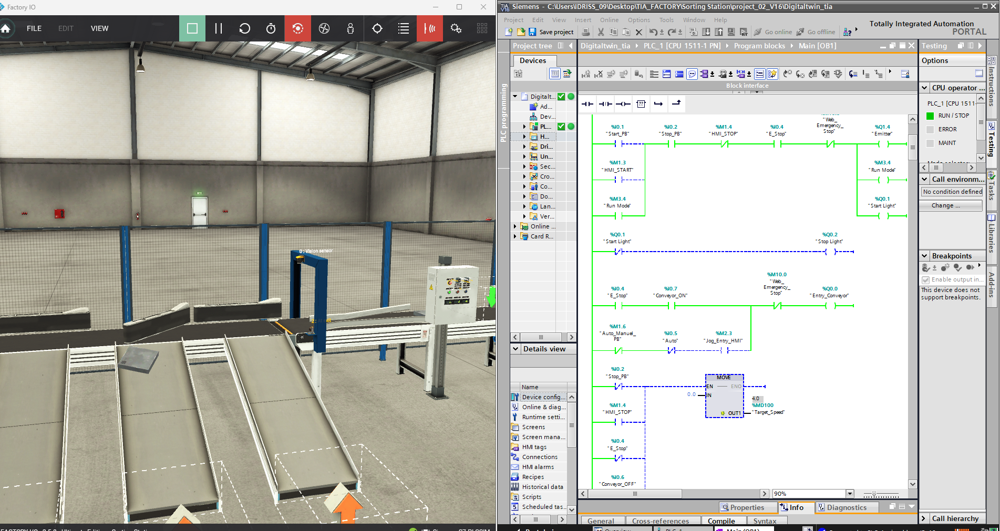
</p>

Factory I/O provides the virtual industrial environment used to reproduce the production process.

The virtual environment allows the industrial control logic to be tested without requiring a complete physical production line.

### Monitored Signals

* Conveyor state
* VFD command
* Vision sensor
* Production counters
* Sorter status
* Equipment health
* Emergency-stop state
* Operator commands

Factory I/O therefore acts as the **virtual production layer** of the cyber-physical system.

---

# 🖥️ 3. TIA Portal + S7-PLCSIM + SCADA

<p align="center">
  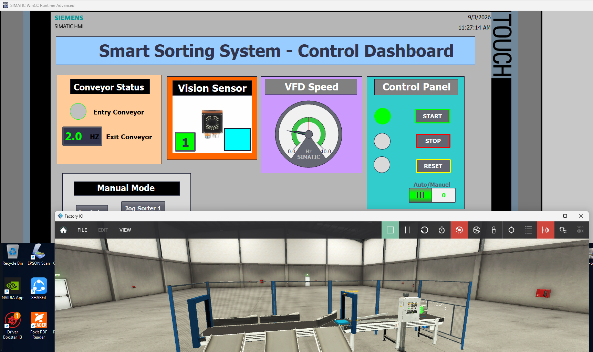
</p>

The Siemens automation layer provides the industrial control logic responsible for the virtual production process.

The PLC environment handles:

* Industrial sequencing
* Conveyor control
* VFD commands
* Digital I/O
* Sensor states
* Production counters
* Safety conditions
* Operator commands
* SCADA System

Communication with the Python middleware is performed through the PLC communication layer.

---

# ⚙️ 4. Physical ESP32 Motor Platform

<p align="center">
  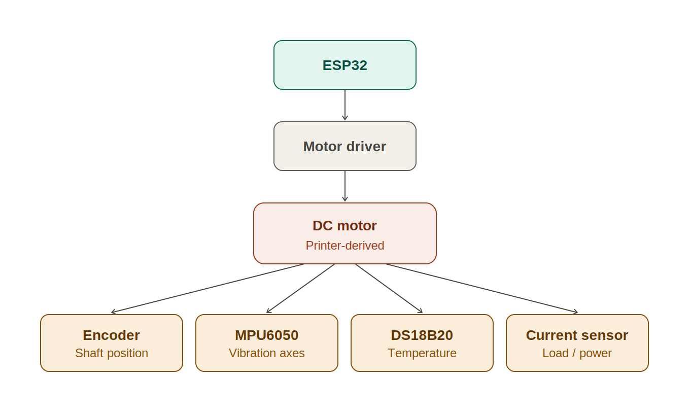
</p>

A real motor prototype is integrated into the system through an ESP32 microcontroller.

The physical platform provides real sensor measurements that are transmitted to the Python backend.

### Hardware

| Component      | Function                           |
| -------------- | ---------------------------------- |
| ESP32          | Embedded control and communication |
| DC Motor       | Physical asset under monitoring    |
| Encoder        | RPM measurement                    |
| MPU6050        | 3-axis vibration measurement       |
| DS18B20        | Temperature measurement            |
| Current Sensor | Motor current monitoring           |
| Motor Driver   | Motor power control                |
| Power Supply   | Motor/driver power                 |

### Measured Variables

| Variable    | Measurement      |
| ----------- | ---------------- |
| RPM         | Encoder          |
| Temperature | DS18B20          |
| Vibration X | MPU6050          |
| Vibration Y | MPU6050          |
| Vibration Z | MPU6050          |
| Current     | Current sensor   |
| PWM         | Motor controller |

Telemetry can be transferred through:

**WiFi / Serial communication**

---

# 📡 5. Industrial Communication Layer

The Python middleware acts as the communication bridge between the virtual industrial environment and the physical platform.

### PLC Communication

```text
TIA Portal
     │
S7-PLCSIM
     │
   Snap7
     │
     ▼
Python Middleware
```

### Physical Communication

```text
ESP32
  │
  ├── WiFi
  │
  └── Serial
       │
       ▼
Python Middleware
```

The middleware provides a common software layer for collecting, processing, storing, and distributing industrial data.

---

# 🤖 6. AI-Based Anomaly Detection

<p align="center">
  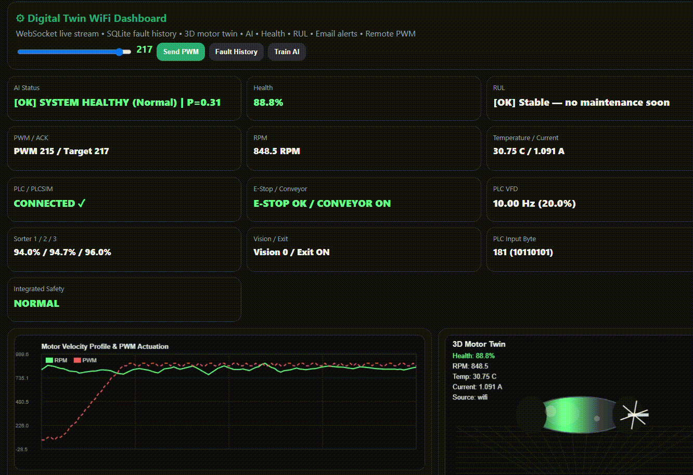
</p>

The system incorporates a **Random Forest machine-learning classifier** for anomaly detection.

The AI model processes operational and sensor features to identify abnormal operating conditions.

### Model Features

The model can use features including:

* PWM
* RPM
* Vibration X
* Vibration Y
* Vibration Z
* Temperature
* Current
* Vibration standard deviation
* Current mean

```text
Sensor Data
     │
     ▼
Feature Extraction
     │
     ▼
Random Forest Model
     │
     ├──── Normal
     │
     └──── Anomaly
              │
              ▼
        Alert / Safety
```

The AI layer is intended to support condition monitoring and predictive maintenance decisions.

---

# ❤️ 7. Multi-Sensor Health Index

A unified **Health Index** is calculated from multiple physical measurements.

The current prototype combines:

* Vibration
* Temperature
* Motor current

### Implemented Weighting

```text
Vibration      → 50%
Temperature    → 35%
Current        → 15%
```

The resulting condition indicator ranges from:

```text
100% ───────────────── Healthy
 │
 │       Normal operation
 │
 ▼
30%  ─────────────── Maintenance threshold
 │
 ▼
0%   ─────────────── Critical
```

The Health Index provides a simplified condition indicator for the monitored asset.

---

# ⏳ 8. Remaining Useful Life Estimation

The prototype includes a **health-index-based Remaining Useful Life (RUL) estimation method**.

The system observes the evolution of the Health Index over time and estimates the progression toward a predefined maintenance threshold.

### Concept

```text
Health Index
100% │████████████████████
     │
     │████████████████
     │
     │████████████
 30% │──────── Maintenance Threshold
     │
  0% │
     └──────────────────────────► Time
```

> **Research note:** The current RUL implementation should be considered a prototype research baseline rather than a fully validated industrial RUL model. Future work will investigate advanced degradation modeling and data-driven RUL prediction methods.

---

# 🪞 9. Real-Time Digital Twin

<p align="center">
  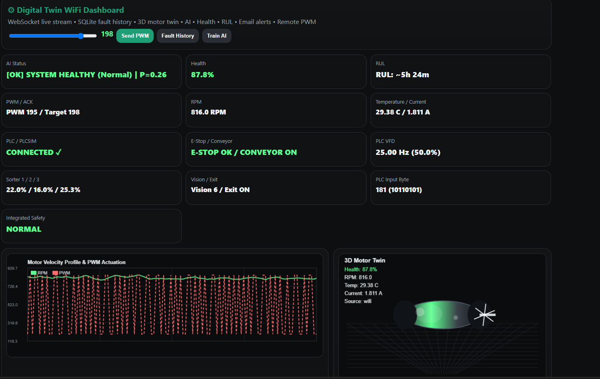
</p>

The project provides a real-time Digital Twin interface for monitoring the physical asset and industrial process.

The dashboard combines:

### Physical Asset Data

* RPM
* Temperature
* Current
* Vibration
* PWM
* Motor state

### AI Information

* AI status
* Anomaly detection
* Health Index
* RUL estimation

### Industrial Information

* PLC status
* Conveyor state
* VFD command
* Production counters
* Equipment status
* Fault events

The Digital Twin provides a unified visualization layer connecting the physical asset, industrial process, AI analytics, and historical data.

---

# 🌐 10. Real-Time Web Dashboard

The backend is implemented using:

**Python + Flask + WebSocket**

The dashboard receives live telemetry and system states.

```text
ESP32 ──────────────┐
                    │
PLC / Factory I/O ──┼──► Python Backend
                    │
AI Engine ──────────┘
                         │
                         ▼
                     WebSocket
                         │
                         ▼
                 Real-Time Dashboard
```

This allows system information to be visualized without repeatedly reloading the web page.

---

# 🗄️ 11. Historical Data and Fault Logging

SQLite is used to maintain historical system information.

### Motor Telemetry

* Timestamp
* RPM
* PWM
* Vibration
* Temperature
* Current
* Health Index
* RUL
* AI status

### PLC Telemetry

* PLC inputs
* Conveyor state
* VFD command
* Vision sensor
* Production counters
* Equipment health

### Fault History

* Fault type
* Timestamp
* Sensor conditions
* Health Index
* Motor state
* Corrective action
<p align="center">
  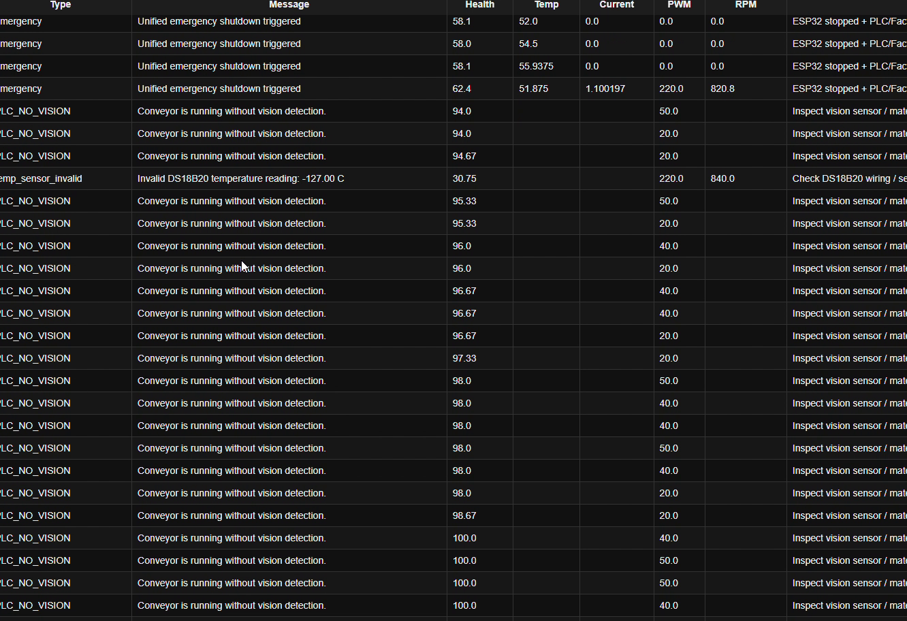
</p>

The historical data layer provides a foundation for future machine-learning and degradation-analysis research.

---

# 🛡️ 12. Unified Safety Architecture

<p align="center">
  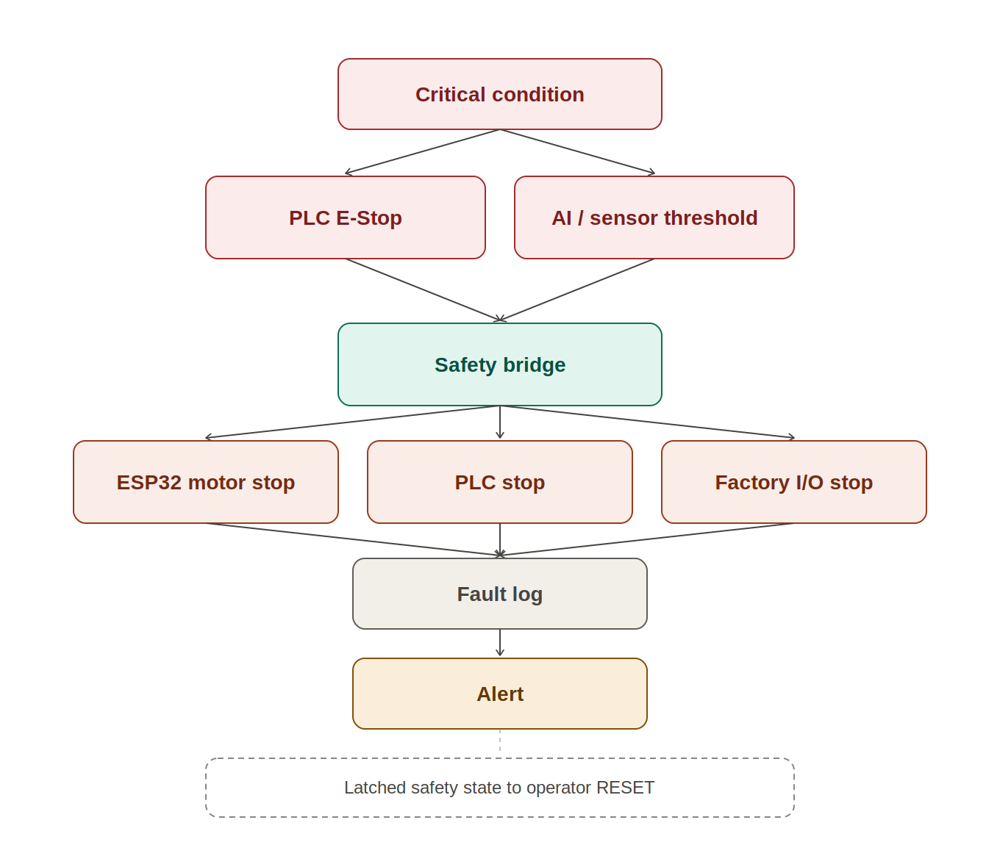
</p>

A key feature of the platform is the coordination of safety actions across the virtual and physical environments.

When a critical condition is detected, the system can coordinate the shutdown of the physical motor and the virtual industrial process.

```text
          Critical Condition
                 │
        ┌────────┴─────────┐
        │                  │
    PLC E-STOP        AI / Sensor Fault
        │                  │
        └────────┬─────────┘
                 ▼
        Python Safety Bridge
                 │
        ┌────────┼──────────┐
        │        │          │
        ▼        ▼          ▼
   ESP32 Motor   PLC     Factory I/O
      STOP       STOP        STOP
        │        │          │
        └────────┼──────────┘
                 ▼
            Fault Logging
                 │
                 ▼
             Alert System
```

The safety state is latched until the appropriate operator reset procedure is performed.

This creates a coordinated response between:

**Physical Equipment + PLC + Virtual Factory + Software Monitoring**

---

# 🚨 13. Fault Detection and Safety Response

<p align="center">
  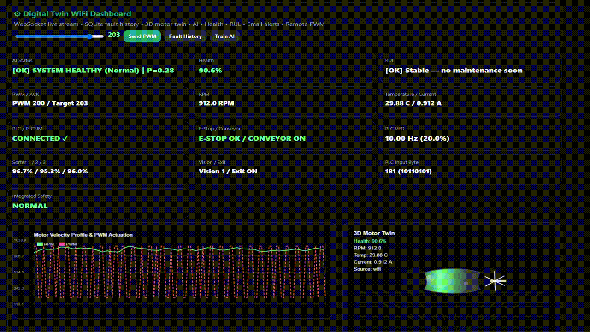
</p>

The system monitors critical operating conditions and can initiate an emergency response.

The safety mechanism is designed around:

* Sensor monitoring
* PLC safety state
* AI anomaly status
* Motor state
* Safety latch
* Operator reset
* Fault logging
* Email notification

### Example Sequence

```text
Abnormal Sensor Condition
          ↓
Condition Monitoring
          ↓
AI / Safety Logic
          ↓
Critical Condition
          ↓
Unified Safety Stop
          ↓
Real Motor OFF
          ↓
PLC / Factory I/O STOP
          ↓
Fault Logged
          ↓
Operator Reset
```

---

# 🔔 14. Automated Alerts

The system can generate email notifications when important faults or safety events occur.

The alert mechanism can provide information including:

* Fault type
* Timestamp
* Motor condition
* Sensor values
* Health Index
* System state

This extends the system from passive monitoring toward **automated maintenance notification**.

---

# 📊 15. Experimental Results

The integrated system has been experimentally tested across both virtual and physical environments.

### Current Capabilities

| Capability                   | Status |
| ---------------------------- | :----: |
| Siemens PLC integration      |    ✅   |
| TIA Portal                   |    ✅   |
| S7-PLCSIM                    |    ✅   |
| Factory I/O                  |    ✅   |
| Snap7 communication          |    ✅   |
| Python industrial middleware |    ✅   |
| Real ESP32 motor             |    ✅   |
| Real sensor acquisition      |    ✅   |
| WiFi / Serial telemetry      |    ✅   |
| AI anomaly detection         |    ✅   |
| Health Index                 |    ✅   |
| RUL prototype                |    ✅   |
| Digital Twin dashboard       |    ✅   |
| SQLite logging               |    ✅   |
| Fault detection              |    ✅   |
| Unified safety response      |    ✅   |
| Email notifications          |    ✅   |

### Experimental Evidence

<p align="center">
  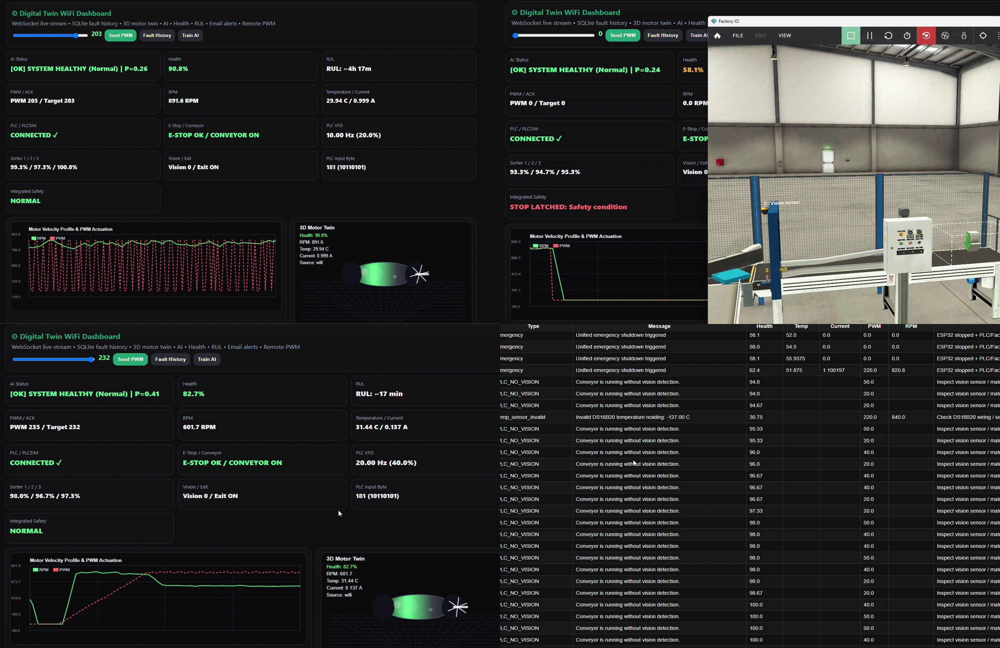

</p>

> Experimental results, screenshots, plots, and additional demonstration evidence will be progressively added to this repository.

---

# 🧪 16. Virtual + Physical Experimental Platform

The platform consists of two complementary environments.

## Virtual Environment

### TIA Portal + S7-PLCSIM + Factory I/O

Used for:

* PLC programming
* Industrial sequence control
* Virtual sensors
* Virtual actuators
* Conveyor control
* Production simulation
* Safety logic validation

## Physical Environment

### ESP32 + Motor + Sensors

Used for:

* Real sensor acquisition
* Motor control
* Vibration monitoring
* Temperature monitoring
* Current monitoring
* Physical anomaly experiments
* Real-time safety response

Together, the two environments create an experimental platform for studying **virtual-physical industrial integration**.

---

# 🔬 17. Research Relevance

This project explores several important Industry 4.0 research domains.

### Digital Transformation

* Digital Twins
* Cyber-Physical Systems
* Industrial IoT
* Smart Manufacturing

### Artificial Intelligence

* Machine Learning
* Anomaly Detection
* Fault Diagnosis
* Predictive Maintenance
* RUL Estimation

### Industrial Automation

* PLC-based control
* Virtual commissioning
* Industrial communication
* Real-time monitoring
* Safety coordination

### Condition Monitoring

* Vibration analysis
* Temperature monitoring
* Current monitoring
* Multi-sensor fusion
* Health assessment

---

# 🧩 18. What Makes This Project Different?

A conventional industrial simulation project may follow:

```text
PLC → Factory I/O
```

This project extends the architecture to:

```text
PLC
 │
 ▼
Factory I/O
 │
 ▼
Python Industrial Middleware
 │
 ├──────────────► AI
 │
 ├──────────────► Database
 │
 ├──────────────► Digital Twin
 │
 └──────────────► Physical ESP32 Motor
                         │
                         ▼
                     Real Sensors
```

The project therefore combines **industrial automation, physical sensing, artificial intelligence, data analytics, and virtual representation within one experimental platform.**

---

# 🛠️ 19. Technologies

| Category                | Technology                   |
| ----------------------- | ---------------------------- |
| PLC                     | Siemens S7                   |
| Engineering             | TIA Portal                   |
| PLC Simulation          | S7-PLCSIM                    |
| Factory Simulation      | Factory I/O                  |
| PLC Communication       | Snap7                        |
| Backend                 | Python / Flask               |
| Real-Time Communication | WebSocket                    |
| AI                      | Scikit-learn / Random Forest |
| Data Processing         | Pandas / NumPy               |
| Database                | SQLite                       |
| Embedded System         | ESP32                        |
| Vibration Sensor        | MPU6050                      |
| Temperature Sensor      | DS18B20                      |
| Motor Measurement       | Encoder                      |
| Motor Control           | PWM / Motor Driver           |
| Frontend                | HTML / JavaScript            |
| Visualization           | Three.js / Chart.js          |
| Notifications           | Gmail SMTP                   |

---

# 📁 20. Repository Structure

Since all project images are stored directly in the main project folder, the structure is:

```text
Integrated-Smart-Factory-Cyber-Physical-System/
│
├── README.md
├── LICENSE
├── .gitignore
├── .env.example
├── requirements.txt
│
├── architecture.png
├── system_overview.png
├── safety_architecture.png
├── wiring_diagram.png
├── demo_thumbnail.png
├── dashboard.png
├── tia_portal.png
├── factory_io.png
├── physical_motor.png
├── ai_detection.png
├── safety_stop.png
└── results.png
```

Your Python, ESP32, TIA Portal, Factory I/O, and model files can remain in their existing locations.

---

# 📸 21. Project Gallery

## 🏭 Complete System

<p align="center">
  
</p>

---

## 🖥️ Siemens TIA Portal + Factory I/O

<p align="center">
  
</p>

<p align="center">
  
</p>

---

## ⚙️ Physical Motor Platform

<p align="center">
  
</p>

---

## 🪞 Digital Twin Dashboard

<p align="center">
  
</p>

---

## 🤖 AI Anomaly Detection

<p align="center">
  
</p>

---

## 🛡️ Unified Safety Response

<p align="center">
  
</p>

---

# 📈 22. Future Research Directions

The current platform provides a foundation for further research in:

### 1. Advanced RUL Prediction

Development of:

* LSTM-based degradation models
* Temporal Transformers
* Survival analysis
* Probabilistic RUL prediction

### 2. Physics-Informed Digital Twins

Combining:

**Physical Models + Sensor Data + Machine Learning**

for improved asset-state estimation.

### 3. Adaptive AI

Development of models capable of adapting to:

* Changing operating conditions
* Different motor loads
* Sensor drift
* New fault patterns

### 4. Edge AI

Deployment of lightweight machine-learning models closer to the physical asset.

### 5. Multi-Asset Predictive Maintenance

Extending the architecture from one motor to multiple industrial assets.

### 6. Intelligent Predictive Control

Combining predictive maintenance with intelligent control strategies.

### 7. Advanced Cyber-Physical Synchronization

Improving synchronization between:

**Physical Asset ↔ Digital Twin ↔ Industrial PLC**

### 8. Industrial Data Fusion

Combining:

**PLC Data + Sensor Data + AI Predictions + Production Data**

into a unified intelligent decision-making platform.

---

# 🎓 23. PhD Research Direction

This project serves as a practical foundation for my future research in:

> **AI-Driven Digital Twins for Predictive Maintenance and Intelligent Industrial Automation**

The developed platform can be extended toward research on:

* Intelligent fault detection and diagnosis
* Data-driven Digital Twins
* Physics-informed Digital Twins
* Advanced RUL prediction
* AI-based predictive maintenance
* PLC–AI integration
* Cyber-Physical Production Systems
* Edge AI for industrial monitoring
* Predictive control
* Intelligent decision-making
* Multi-asset Digital Twins
* Real-time synchronization between physical and virtual systems

The long-term objective is to develop intelligent industrial systems capable of:

**monitoring → diagnosing → predicting → deciding → responding**

to equipment degradation in real time.

---

# 👨‍🔬 24. Author

## Bencheikh Mohamed Idris

**M.Sc. Automation & Industrial Computing**
**Université Blida 1**

### Research Interests

**Industrial Automation · Artificial Intelligence · Digital Twins · Predictive Maintenance · Cyber-Physical Systems · Industry 4.0 · Intelligent Control**

📧 **Email:** `bencheikhmohamed800@gmail.com`

🔗 **GitHub:** `https://github.com/Idriss099`

---
---

# 🚀 Installation & Usage

[#-installation--usage](#-installation--usage)

## Prerequisites

[#prerequisites](#prerequisites)

Before running the system, make sure you have:

- **Python 3.10+**
- **Siemens TIA Portal** (for PLC programming/editing)
- **S7-PLCSIM** (virtual PLC runtime)
- **Factory I/O** (virtual production environment, licensed)
- **ESP32 board** + DC motor + sensors (Encoder, MPU6050, DS18B20, current sensor)
- **Arduino IDE** (to flash the ESP32 firmware)
- A **Gmail account** with an [App Password](https://support.google.com/accounts/answer/185833) (for email alerts)

---

## 1. Clone the repository

[#1-clone-the-repository](#1-clone-the-repository)

```bash
git clone https://github.com/Idriss099/Advanced-Digital-Twin-Predictive-Maintenance-System.git
cd Advanced-Digital-Twin-Predictive-Maintenance-System
```

## 2. Set up the Python environment

[#2-set-up-the-python-environment](#2-set-up-the-python-environment)

```bash
python -m venv venv

# Windows
venv\Scripts\activate

# Linux / macOS
source venv/bin/activate

pip install -r requirements.txt
```

## 3. Configure environment variables

[#3-configure-environment-variables](#3-configure-environment-variables)

Copy the example environment file and fill in your own values:

```bash
cp .env.example .env
```

Edit `.env` and set:
- `PLC_IP`, `PLC_RACK`, `PLC_SLOT` → your S7-PLCSIM / PLC connection
- `ESP32_CONNECTION_MODE`, `ESP32_IP` or `ESP32_SERIAL_PORT` → how the backend talks to the ESP32
- `SMTP_SENDER_EMAIL`, `SMTP_APP_PASSWORD`, `ALERT_RECIPIENT_EMAIL` → email alerts

## 4. Set up the virtual PLC & factory

[#4-set-up-the-virtual-plc--factory](#4-set-up-the-virtual-plc--factory)

1. Open the PLC project in **TIA Portal** (`/plc_project`).
2. Download the program to **S7-PLCSIM**.
3. Open **Factory I/O**, load the matching scene, and connect it to S7-PLCSIM as the I/O driver.

## 5. Flash the ESP32

[#5-flash-the-esp32](#5-flash-the-esp32)

1. Open the firmware in `/esp32` with the **Arduino IDE**.
2. Set your WiFi credentials (if using WiFi mode) at the top of the sketch.
3. Select the correct board/port and click **Upload**.
4. Wire the motor, encoder, MPU6050, DS18B20, and current sensor as described in `/docs/wiring_diagram.png`.

## 6. Run the backend (middleware + AI + Digital Twin server)

[#6-run-the-backend-middleware--ai--digital-twin-server](#6-run-the-backend-middleware--ai--digital-twin-server)

```bash
python backend/app.py
```

This starts:
- The **Snap7** connection to the PLC
- The **serial/WiFi** listener for the ESP32
- The **AI anomaly detection** engine
- The **Flask + WebSocket** server for the Digital Twin dashboard
- **SQLite** logging of telemetry and faults

## 7. Open the Digital Twin dashboard

[#7-open-the-digital-twin-dashboard](#7-open-the-digital-twin-dashboard)

Once the backend is running, open your browser at:

```
http://localhost:5000
```

You should see live RPM, temperature, current, vibration, Health Index, RUL estimation, and PLC/production status.

## 8. Operate the system

[#8-operate-the-system](#8-operate-the-system)

- Use the dashboard **START / STOP / RESET** controls to operate the virtual factory and the physical motor together.
- Trigger a fault (e.g. block the conveyor in Factory I/O, or induce abnormal vibration on the physical motor) to see the **AI detection → unified safety stop → email alert → fault log** sequence in action.

---

## Troubleshooting

[#troubleshooting](#troubleshooting)

| Issue | Likely cause |
|---|---|
| Backend can't connect to PLC | S7-PLCSIM not running, or wrong `PLC_IP`/`PLC_RACK`/`PLC_SLOT` |
| No data from ESP32 | Wrong `ESP32_CONNECTION_MODE`, wrong port/IP, or firmware not flashed |
| No email alerts | Gmail App Password not set, or 2FA not enabled on the sender account |
| Dashboard shows no live data | WebSocket blocked by firewall, or backend not running |
---

# 📜 License

This project is released under the license included in this repository.

---

<p align="center">

### 🚀 AI-Driven Digital Twins for Intelligent Industrial Automation

**Virtual Factory × Physical Asset × Artificial Intelligence × Digital Twin**

</p>
